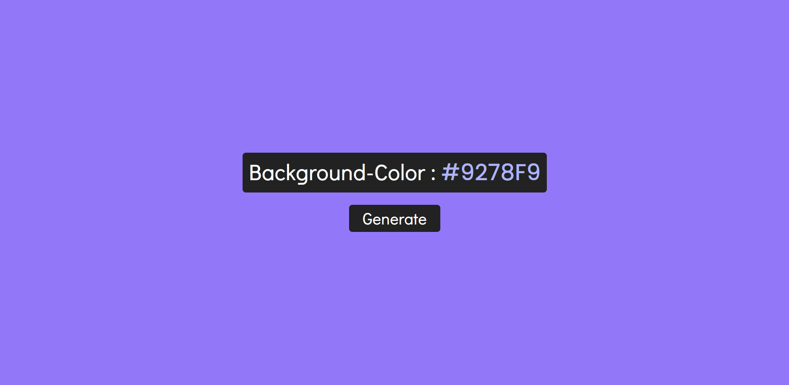
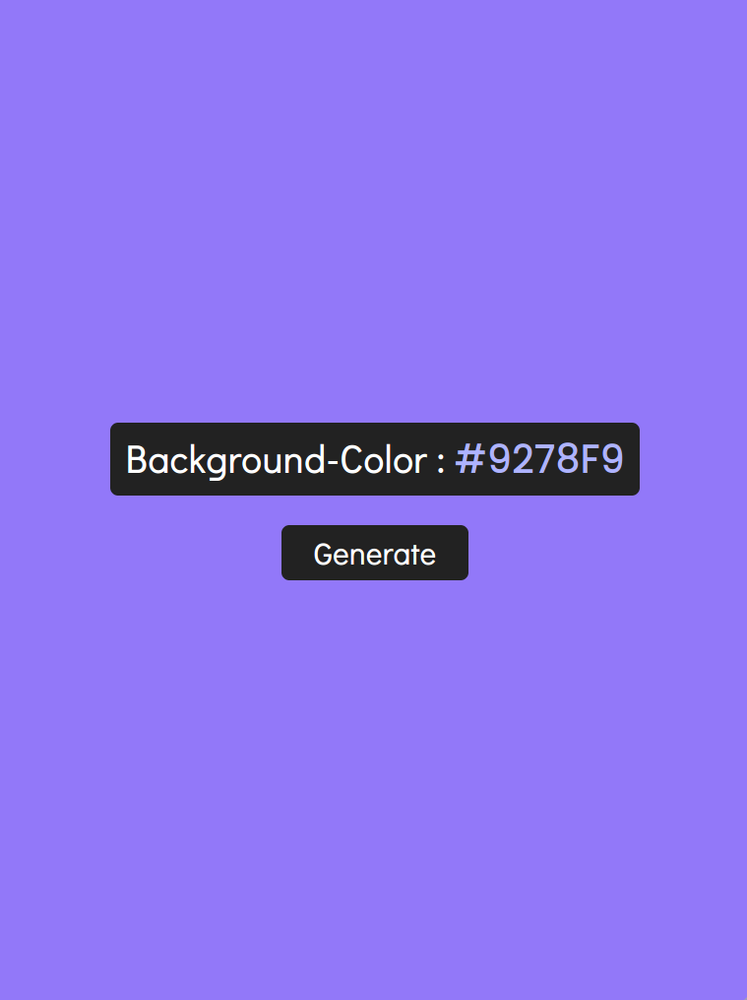
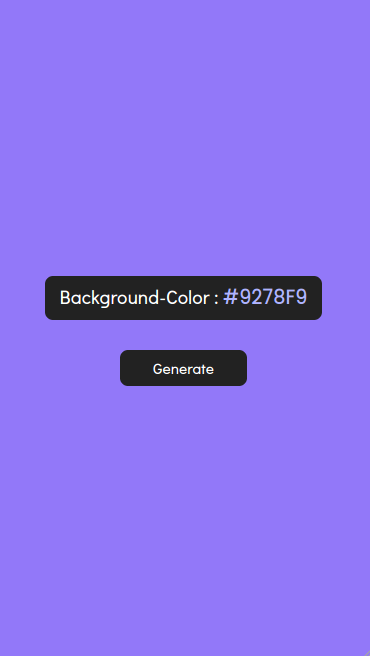

# Color Flipper
a Project That Generates Random HEX Colors Each Time You Execute the Program
# Screenshots
* ### LapTop Screenshot

 
 

* ### Tablet Screenshot

 
 

* ### Phones Screenshot

 
 

# Implemented Technologies
* #### HTML
* #### CSS
    * Grid
    * Flex
    * Media Query
* #### JavaScript
# Features
* Generating Random HEX Colors Values
* Clicking On The HEX Value Leads To It Being Copied To The Clipboard
# License
 This Project Is Licensed Under **WTFPL**

 WTFPL &copy; [OussamaKamili](https://github.com/oussamakami/Color-Flipper-js/blob/master/LICENSE)